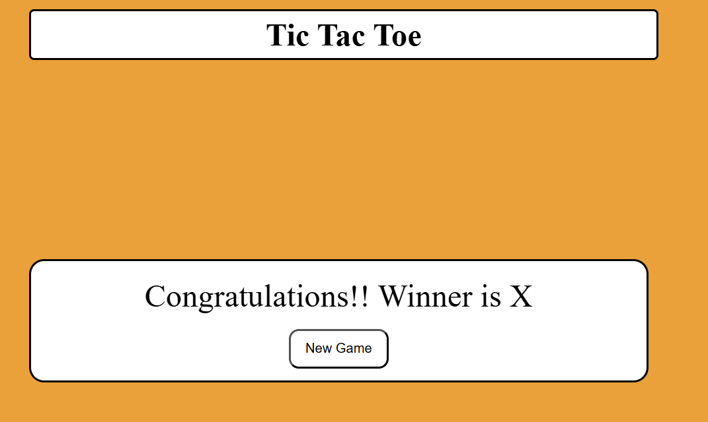
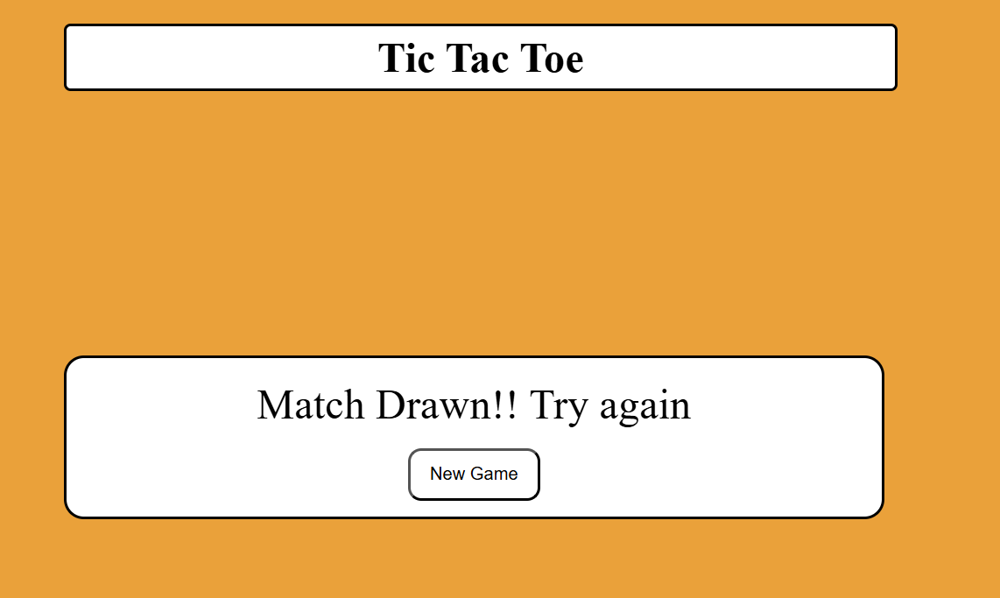

# ❌⭕ Tic Tac Toe – Classic Browser Game

A clean and interactive version of the classic **Tic Tac Toe** game built with **HTML, CSS, and JavaScript**. Two players take turns marking Xs and Os in a 3×3 grid. The game detects wins and draws in real-time and provides a smooth, user-friendly experience.

---

## 🔗 Live Demo

👉 **Play here**: [https://yourusername.github.io/tic-tac-toe](https://yourusername.github.io/tic-tac-toe)  
_(Replace with your actual GitHub Pages or Netlify/Vercel link)_

---

## 🖼️ Screenshots

### 🎮 Game Board


### 🏆 Win Popup


### 🤝 Draw Popup


> _Put your screenshots in a `/screenshots` folder and make sure the image paths match._

---

## 🕹️ Features

- ✅ **Two-player mode** with turn-based play
- 🔒 **No cell overwrites** — once marked, a cell can't be changed
- 🧠 **Automatic win detection** with instant game stop
- 🤝 **Draw detection** when all cells are filled with no winner
- 📢 **Popups** for "You Win", "You Lose", or "Draw"
- 🎨 **Clean and responsive design** using pure HTML and CSS
- ⚡ **No frameworks or libraries** — 100% vanilla JavaScript

---

## 🧰 Tech Stack

- **HTML** – Semantic structure of the board and UI
- **CSS** – Responsive design and button styling
- **JavaScript** – Game logic and interactivity

---

## 📁 Folder Structure

📁 tic-tac-toe/
┣ 📁 screenshots/
┃ ┣ 📄 board.png
┃ ┣ 📄 win.png
┃ ┗ 📄 draw.png
┣ 📄 index.html
┣ 📄 style.css
┗ 📄 script.js

yaml
Copy
Edit

---

## 🚀 How to Run Locally

```bash
git clone https://github.com/yourusername/tic-tac-toe.git
cd tic-tac-toe
open index.html
