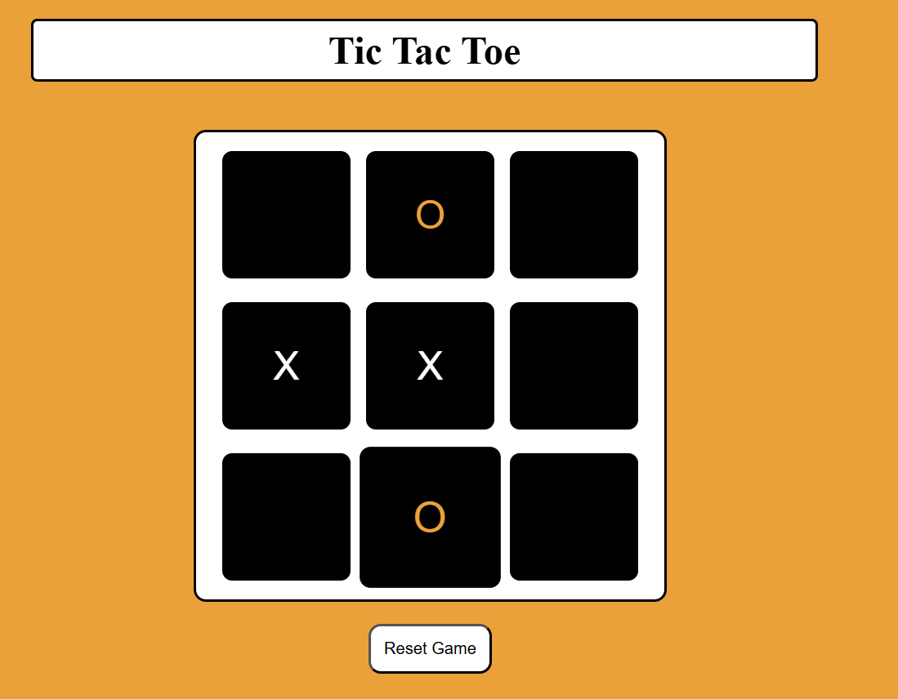

# Tic Tac Toe – Classic Web Game

A modern, interactive implementation of the timeless **Tic Tac Toe** (Noughts and Crosses) game built with **HTML, CSS, and JavaScript**. Challenge a friend in two-player mode, with real-time win and draw detection, stylish animations, and a smooth, enjoyable experience—all in your browser.

---

## 🔗 Live Demo

👉 **Play Online:** (https://tic-tac-toe-indol-kappa.vercel.app/)

---

## 🖼️ Preview

<div align="center">

  
  <p><strong>🎮 Game Board</strong></p>

  
  <p><strong>🏆 Win Popup</strong></p>

  
  <p><strong>🤝 Draw Popup</strong></p>

</div>

---

## 🎮 Features

- **Two-Player Mode:** Play locally with a friend on the same device
- **No Overwriting:** Cells can be marked only once—no accidental changes
- **Auto Win Detection:** Game ends instantly when a player wins
- **Draw Detection:** Recognizes and alerts when the grid is full and it's a tie
- **Animated Popups:** Clear alerts for Win, Lose, or Draw scenarios
- **Responsive Design:** Looks great on desktop and mobile
- **Lightweight:** No external libraries or frameworks—pure HTML/CSS/JS

---

## 🧰 Tech Stack

- **HTML5:** Semantic layout for accessibility and SEO
- **CSS3:** Responsive, modern styling and layout
- **JavaScript (ES6):** Game logic and dynamic UI updates

---

## 📁 Folder Structure

```
tic-tac-toe/
├── screenshots/
│   ├── board.png
│   ├── win.png
│   └── draw.png
├── index.html
├── style.css
└── script.js
```

---

## 🚀 Getting Started

### 1. Clone the Repository

```bash
git clone https://github.com/yourusername/tic-tac-toe.git
cd tic-tac-toe
```

### 2. Run the Game

Just open `index.html` in your favorite browser:

- Double-click `index.html`, **or**
- Run a simple web server (recommended for best experience):

---

## ✨ Customization

- **Change theme colors** in `style.css` to match your taste.
- **Replace or add screenshots** in the `/screenshots` folder.
- **Modify win/draw messages** in `script.js` for a personalized touch.

---
